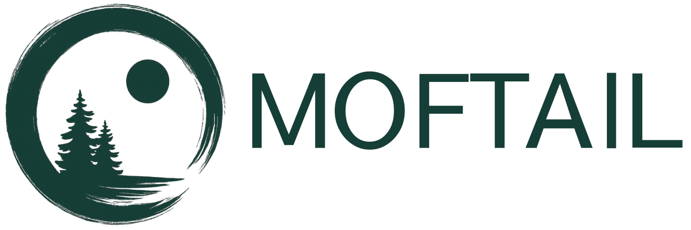
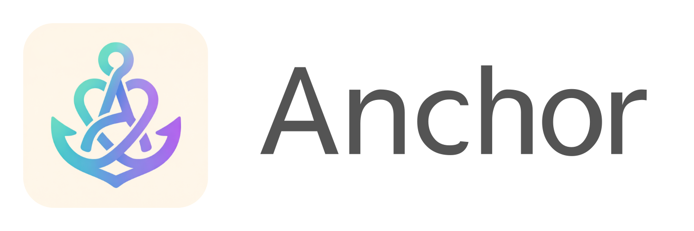

# Portfolio — Ryunosuke Nakamura

  <strong>Observe real-world friction. Frame product problems. Ship with AI-assisted workflows.</strong>

  <a href="https://ryuusuraimu.github.io/">https://ryuusuraimu.github.io/</a>

---

## Overview

現実の摩擦を観察し、プロダクト課題として整理し、動く形に落とす。  
そのプロセスそのものを見せるためのポートフォリオサイトです。

MoftailやAnchorなど、自分で運営・制作してきたプロジェクトを通して、  
課題発見から仕様化、実装、改善までのプロセスをまとめています。

---

## Why this repository is public

このサイトは、AIを開発ワークフローに組み込みながら制作しました。  
Claude / ChatGPT / Cursor などを併走させ、UI設計・実装方針・文章設計・改善案を検討しながら、最短で動く形に落としています。

Publicにしているのは、見せたいものが「完成した画面」だけではなく、  
その背後にある意思決定のプロセスだからです。

| I want to show | What it means |
|---|---|
| **Observation** | どんな摩擦を観察したか |
| **Framing** | それをどう問いに変換したか |
| **Judgment** | AIに何を任せ、どこを自分で判断したか |
| **Shipping** | どう仕様化し、どこで止めて、どう出荷したか |

AIをどれだけ深く使えるかではなく、  
**AIを使った上で自分が何を判断したか**が、AI時代の作り手の輪郭を決めると考えています。

---

## What this portfolio shows

このポートフォリオは、SaaS企業の長期インターン応募を見据え、  
自分の思考と制作プロセスをドキュメント化したものです。

特に見ていただきたいのは、以下の3点です。

| Focus | Description |
|---|---|
| **Observation** | 日常や事業運営の中の小さな摩擦を拾う力 |
| **Framing** | その摩擦をプロダクト課題として構造化する力 |
| **Shipping** | AIを活用しながら、短いサイクルで動く形に落とす力 |

サイト内の **HOW I WORK** と **HOW I USE AI** セクションが、  
この3点に対する自分なりの回答です。

---

## Projects

### 🦊 Moftail — Shopify-based POD Brand for the US Market

ShopifyとPrintifyで運営しているPODアパレルブランドです。  
販売サイトではなく、EC運営の摩擦を自ら触って検証する **Product Lab** として位置づけています。

| Area | What I worked on |
|---|---|
| **Commerce** | Shopify / Printify / 商品ページ改善 |
| **Marketing** | Meta広告 / クリエイティブ検証 |
| **UX** | PDP改善 / FAQ設計 / レビュー導線 |
| **Brand** | stillness / intentionality / minimalism を軸にした世界観設計 |

このサイトで言う **real-world friction** の多くは、Moftailの運営を通して拾いました。

  <a href="https://moftail.com"><strong>View WebSite →</strong></a>

---

### ⚓ Anchor — iOS App for Panic Situations

パニック時の判断負荷を減らすために設計したSwiftUI製アプリです。  
Apple Swift Student Challenge に提出しました。

当事者ではなく「そばにいる人」が動けるように設計したのが核で、  
事前メッセージ・オフラインQR・ショートカット連携により、緊急時に **考えなくていい状態** を作ることを狙っています。

| Design Focus | Reason |
|---|---|
| **Supporter-first UX** | パニック時の本人は判断できない可能性があるため |
| **Offline QR** | 緊急時に通信が不安定でも情報を渡せるようにするため |
| **Shortcut integration** | 画面操作の負荷を減らすため |

  <a href="https://github.com/ryuusuraimu/Anchor.swiftpm"><strong>View repository →</strong></a>

---

## How I use AI

> AIに答えを出させるのではなく、AIに議論させて、自分で判断する。

同じ問いを複数のAIに投げ、提案の差分・前提・リスクを比較してから、  
自分で仕様に落とし込みます。

これはこのサイトだけでなく、MoftailやAnchorでも共通している進め方です。

| Step | Role |
|---|---|
| **Explore** | 複数のAIに同じ問いを投げ、出力の違いを観察する |
| **Debate** | AIに意見を出させ、自分は判定者として読む |
| **Design** | UIから先に作り、流れと違和感を磨く |
| **Ship** | 仕様を固めてから Claude Code / Codex に渡す |
| **Review** | 実際に触って違和感を見つけ、改善点に戻す |

詳細はサイトの **HOW I USE AI** を参照してください。

---

## Decision Log

このサイトと並行して運営・制作しているプロダクトで、実際に下した判断の一部です。  
判断の正しさそのものよりも、**何を前提に置き、どう優先順位を決めたか**を残しています。

### Moftail

| Decision | Reason |
|---|---|
| ブランドトーンを「stillness / intentionality / minimalism」に固定し、広告クリエイティブもこの軸でフィルタすると決めた | 短期のCTR / CVRだけに寄せるとブランドの再現性が崩れるため、広告改善とブランド資産の両方を見ながら検証するため |
| PDPの装飾を削り、信頼導線（レビュー / 配送 / FAQ）を上に寄せた | US市場のPOD購入では「信頼の壁」が大きいという仮説に基づき、世界観よりも購入前の不安解消を優先したため |

### Anchor

| Decision | Reason |
|---|---|
| 当事者ではなく「そばにいる人」を主ユーザーに据えた | パニック時の本人は判断できない前提に立つと、UXの設計対象が本人から周囲の支援者へ変わるため |
| 通信前提の機能を後回しにし、まずはオフラインQRを優先した | 緊急時はネットワーク不安定・画面操作の負荷が高いという条件を優先したため |

---

## Tech Stack

| Area | Tools |
|---|---|
| **Frontend** | HTML / CSS / JavaScript / React / TypeScript |
| **Mobile** | SwiftUI |
| **Commerce** | Shopify / Liquid / Printify / Meta Ads |
| **AI Tools** | Claude / ChatGPT / Cursor / Claude Code / Codex |

---

## Current Focus / Next Improvements

現在はスピードと仮説検証を優先しており、今後は以下を順に磨いていく予定です。

- コンポーネント設計の整理
- レスポンシブ表示の最適化
- アクセシビリティ改善
- 各プロジェクトの詳細ページ追加
- 制作過程と意思決定ログの整理

---

## Message

> 人が情報に迷う瞬間を減らすために、  
> 検索・UX・情報設計を組み合わせたプロダクトづくりに挑戦しています。
>
> **Let's build.**
